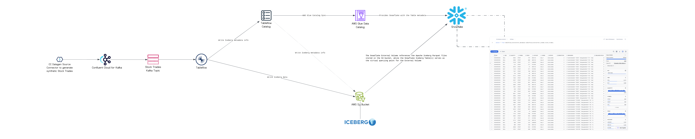

# Confluent Cloud for Apache Flink (CCAF) Tableflow AWS Glue Snowflake Kickstarter
Data practitioners are entering a golden era-a time defined by groundbreaking possibilities and transformative innovation. In the early days, building data warehouses required enormous intellectual and financial investments. We carefully engineered and maintained limited conforming dimensions and facts, continuously adapting to meet evolving business needs. Transferring data from source to target not only incurred high costs but also stripped away vital context, which had to be painstakingly rebuilt to derive actionable insights.

As we evolved to data lakes, many challenges persisted: maintenance overhead, slow adaptability to surging data demands, and the constant struggle to preserve context. With the burgeoning tide of ML and AI, the stakes have escalated even further. Yet, these challenges are paving the way for unprecedented opportunities for innovation and efficiency. Today, every obstacle is a stepping stone toward a more agile, insightful, and future-ready data landscape.

On [March 19, 2025](https://docs.confluent.io/cloud/current/release-notes/index.html#march-19-2025), Confluent proudly announced the general availability of [Tableflow for Apache Iceberg](https://docs.confluent.io/cloud/current/topics/tableflow/overview.html#cloud-tableflow), marking a transformative milestone for data warehousing and data lakes. This monumental release redefines data management by seamlessly addressing the complexities of modern data infrastructures. Leveraging the unparalleled power of our fully managed open-source trifecta—Apache Kafka, Apache Flink, and Apache Iceberg—we now deliver a unified solution that adeptly serves both operational and analytical data needs.


[TODO --- What is Tableflow?]

Welcome to the forefront of the data revolution, where every challenge is an opportunity and innovation knows no bounds.

<!-- toc -->
+ [**1.0 The Impetus**](#10-the-impetus)
    - [**1.1 What is Apache Iceberg?**](#11-what-is-apache-iceberg)
    - [**1.1.1 How AWS Glue Data Catalog makes Apache Iceberg work**](#111-how-aws-glue-data-catalog-makes-apache-iceberg-work)
    - [**1.2 Why Apache Iceberg is a Game-changer?**](#12-why-apache-iceberg-is-a-game-changer)
+ [**2.0 Let's Get Started!**](#20-lets-get-started)
    - [**2.1 DevOps in Action: Running Terraform Locally**](#21-devops-in-action-running-terraform-locally)
    - [**2.2 Visualizing the Terraform Configuration**](#22-visualizing-the-terraform-configuration)
+ [**3.0 Resources**](#30-resources)
    - [**3.1 Confluent Cloud for Apache Kafka (CCAK)**](#31-confluent-cloud-for-apache-kafka-ccak)
    - [**3.2 Confluent Cloud for Apache Flink (CCAF)**](#32-confluent-cloud-for-apache-flink-ccaf)
    - [**3.3 Tableflow for Apache Iceberg**](#33-tableflow-for-apache-iceberg)
    - [**3.4 AWS Glue Data Catalog**](#34-aws-glue-data-catalog)
    - [**3.5 Snowflake**](#35-snowflake)
+ [**4.0 Important Note(s)**](#40-important-notes)
<!-- tocstop -->

## 1.0 The Impetus
The driving force behind this project is the need to **simplify** and **automate** the process of [setting up](https://docs.confluent.io/cloud/current/topics/tableflow/how-to-guides/overview.html) a Confluent Cloud environment with [Tableflow for Apache Iceberg](https://docs.confluent.io/cloud/current/topics/tableflow/overview.html#cloud-tableflow), [AWS S3 Bucket](https://docs.confluent.io/cloud/current/topics/tableflow/how-to-guides/configure-storage.html#bring-your-own-storage-byos), [AWS Glue Data Catalog](https://docs.confluent.io/cloud/current/topics/tableflow/how-to-guides/catalog-integration/integrate-with-aws-glue-catalog.html), and Snowflake Database. The goal is to eliminate the [_manual steps_](https://docs.confluent.io/cloud/current/topics/tableflow/how-to-guides/overview.html) involved in configuring these components, allowing data practitioners like you to focus on building data products instead of managing infrastructure.

Turned this picture:


Into reality:


With the assistance [Terraform](https://developer.hashicorp.com/terraform), a powerful tool for infrastructure as code (IaC), you can define and manage your infrastructure using declarative configuration files. This project utilizes Terraform to automate the setup of Confluent Cloud, AWS S3 Bucket, AWS Glue Data Catalog, and Snowflake, ensuring a **_consistent_** and **_repeatable_** deployment process.

## 1.1 What is Apache Iceberg?
The primary purpose of this project is to highlight Tableflow, Confluent Cloud's Apache Iceberg implementation.  With that said, let's answer what is Apache Iceberg.  Apache Iceberg was created in 2017 by Netflix’s Ryan Blue and Daniel Weeks. It is an open table format designed to resolve the deficiencies of working with data lakes, especially those on a distributed storage system, Amazon S3. A table format is a method of structuring a dataset’s files to present them as a unified “table.” From the user’s perspective, it can be defined as the answer to the question, “What data is in this table?” However, to implement a table format on a distributed storage system, Apache Iceberg needed to overcome several challenges posed by distributed storage systems:

Problem|Challenge|Impact|Solution
-|-|-|-
**Lack of Consistency and ACID Guarantees**|Distributed storage systems are typically designed for object storage, not traditional database operations. This leads to issues with consistency, especially during concurrent read and write operations.|Without ACID (Atomicity, Consistency, Isolation, Durability) guarantees, operations like updates, deletes, and inserts can become error-prone, leading to inconsistent data views across different sessions or processes.|_Apache Iceberg provides ACID compliance, ensuring reliable data consistency on distributed storage systems._
**Bloated Metatdata Files and Slow Query Performance**|As datasets grow in size, so does the metadata (file paths, schema, partitions) associated with them. Efficiently querying large volumes of metadata can become slow and inefficient.|Simple operations like listing files in a directory can become time-consuming, affecting the performance of queries and applications.|_Apache Iceberg organizes data into partitions and adds metadata layers, reducing the need to scan the entire dataset and optimizing query performance. This approach allows for filtering data at the metadata level, which avoids loading unnecessary files._
**Lack of Schema Evolution and Data Mutability**|Analytic datasets often require schema changes (e.g., adding or renaming columns) as business requirements evolve. Distributed storage formats typically lack built-in support for handling schema changes efficiently.|Without schema evolution support, datasets require complex data transformations or complete rewrites, which can be slow and resource-intensive.|_Apache Iceberg allows schema changes without reprocessing the entire dataset, making it easy to add new fields or alter existing ones over time._
**Inefficient Partitioning and Data Skipping**|Distributed storage systems don't natively support data partitioning, which is crucial for optimizing queries on large datasets.|Lack of partitioning increases query latency because the system has to scan more data than necessary.|_Apache Iceberg allows hidden partitioning and metadata-based pruning, ensuring queries only read the required partitions, reducing scan times and improving performance._
**Lack of Data Versioning and Time Travel**|Many analytic workflows need to access previous data versions for tasks like auditing, debugging, or historical analysis. Distributed storage doesn’t offer built-in support for versioning.|Maintaining multiple versions of the same dataset becomes cumbersome, especially without efficient version control, and can lead to excessive storage costs.|_Apache Iceberg offer time travel, allowing users to access snapshots of data at different points in time, providing easy access to historical data._
**Unable to do Concurrent Read and Write Operations**|Large analytic workloads often involve multiple processes reading from and writing to the same data simultaneously. Distributed storage systems do not inherently support these concurrent operations smoothly.|Without proper handling, this can lead to data corruption or version conflicts, especially during high-throughput operations.|_Apache Iceberg’s transactional model enables concurrent operations safely by managing snapshots and transactions, ensuring data integrity and consistency._
**Too Many Small Files**|Distributed storage systems can accumulate many small files over time due to frequent appends or updates.|Small files lead to inefficient I/O operations and high metadata costs, degrading query performance and increasing storage costs.|_Apache Iceberg handles file compaction as part of data maintenance routines, merging small files into larger ones to optimize storage and access efficiency._

By addressing these challenges, the Apache Iceberg table format provides the following for your data lakehouse solutions (that combines the best of data warehouse and data lake design):
* enables scalablility, 
* high-performance, 
* easy-to-use, and 
* lowers cost. 

### 1.1.1 How AWS Glue Data Catalog makes Apache Iceberg work
With the challenges resolved by Apache Iceberg when working on a distributed storage system, the question arises: how does it manage the _metadata_? This is where Apache Iceberg utilizes a catalog engine, that is **AWS Glue Data Catalog** to:
* ACID transactions,
* time travel,
* schema evolution,
* version rollback,
* partition pruning,
* column statistics,
* data compaction,
* centralized metadata,
* simplified ETL,
* data governance, and
* integration with processing engines (e.g., **Flink**, and **Snowflake**).

The Apache Iceberg metadata is organized in a heirarchical tree structure, with metadata files at the top, followed by manifest lists, and then manifest files:


* **Metadata files:** Files that define a table’s structure, including its schema, partitioning scheme, and a listing of snapshots.
* **Manifest lists:** Files that define a single snapshot of the table as a list of manifest files and stats on those manifests that allow for creating more efficient execution plans.
* **Manifest files:** A list of data files containing each data file’s location/path and key metadata about those data files, which allows for creating more efficient execution plans.

## 1.2 Why Apache Iceberg is a Game-changer?
The true power of Apache Iceberg is that it allows for the separation of storage from compute. This means we are **NO LONGER LOCKED INTO** a single data vendor’s compute engine (e.g., **Flink**, and **Snowflake**)! We store the data independently of the compute engine in our distributed storage system (Amazon S3). Then, we connect to the compute engine that best fits our use case for whatever situation we use our data in! Moreover, we could have one copy of the data and use different engines for different use cases. Now, let that sit with you!


> Imagine the freedom to choose the most cost-effective solution every time you process your data. Whether Apache Flink is more budget-friendly than Snowflake or vice versa, you have the power to decide! Your data isn’t locked into any specific compute engine, giving you ultimate flexibility to optimize for both performance and cost.


## 2.0 Let's Get Started!

**These are the steps**

1. Take care of the local environment prequisities listed below:
    * You need to have the following installed on your local machine:
        - [AWS CLI version 2](https://docs.aws.amazon.com/cli/latest/userguide/getting-started-install.html)
        - [Confluent CLI version 4 or higher](https://docs.confluent.io/confluent-cli/4.0/overview.html)
        - [Terraform CLI version 1.12.2 or higher](https://developer.hashicorp.com/terraform/install)

2. Get your Confluent Cloud API key pair, by execute the following Confluent CLI command to generate the Cloud API Key:

    > Click [here](.blog/why-do-you-need-the-confluent-cloud-api-key.md#2-integration-with-cicd-pipelines) to learn why you need it.

    ```shell
    confluent api-key create --resource "cloud" 
    ```

    The API Key pair allows Terraform to provision, manage, and update Confluent Cloud resources as defined in your infrastructure code, maintaining a secure, automated deployment pipeline.

3. Clone the repo:
    ```bash
    git clone https://github.com/j3-signalroom/ccaf-tableflow-aws_glue-snowflake-kickstarter.git
    ```

4. Apart of the Terraform configurations, is the `snowflake_user_rsa_key_pairs_rotation`, the [`iac-snowflake-user-rsa_key_pairs_rotation-tf_module`](https://github.com/j3-signalroom/iac-snowflake-user-rsa_key_pairs_rotation-tf_module) Terraform [module](https://developer.hashicorp.com/terraform/language/modules) to automate the creation and rotation of [RSA key pairs](https://github.com/j3-signalroom/j3-techstack-lexicon/blob/main/cryptographic-glossary.md#rsa-key-pair) for a Snowflake service account user.  It leverages a specialized AWS Lambda function, known as the [`iac-snowflake-user-rsa_key_pairs_generator-lambda`](https://github.com/j3-signalroom/iac-snowflake-user-rsa_key_pairs_generator-lambda), to automate the generation and rotation of RSA key pairs. The module allows users to define rotation intervals (e.g., every 30 days since the last key generation) to enhance security by regularly renewing cryptographic credentials. Additionally, it integrates seamlessly with AWS Secrets Manager to securely store and manage the generated key pairs, ensuring that the keys remain protected and easily accessible for Snowflake authentication without manual intervention.

### 2.1 DevOps in Action: Running Terraform Locally
Install the [Terraform CLI](https://developer.hashicorp.com/terraform/tutorials/aws-get-started/install-cli) on your local machine, and make sure you have an [HCP Terraform account](https://app.terraform.io/session) to run the Terraform configuration.  Learn how to set up Terraform Cloud for local use by clicking [here](.blog/setup-terraform-cloud.md).

Then run the following command to set up the Terraform configuration locally. This command will create a Confluent Cloud environment with a Kafka Cluster configured for Tableflow, AWS Secrets Manager, an AWS S3 bucket, AWS Glue Data Catalog, and Snowflake Database:

> **Note**: _The script and this project in general assumes your hyperscaler (i.e., cloud provider) is **AWS**.  Moreover, that it is expected the AWS account is configured with SSO (Single Sign On) support._

```bash
deploy.sh <create | delete> --profile=<SSO_PROFILE_NAME> \
                            --confluent-api-key=<CONFLUENT_API_KEY> \
                            --confluent-api-secret=<CONFLUENT_API_SECRET> \
                            --snowflake-warehouse=<SNOWFLAKE_WAREHOUSE> \
                            --day-count=<DAY_COUNT> \
                            --number-of-api-keys-to-retain=<NUMBER_OF_API_KEYS_TO_RETAIN>
```
> Argument placeholder|Replace with
> -|-
> `<SSO_PROFILE_NAME>`|your AWS SSO profile name for your AWS infrastructue that host your AWS Secrets Manager.
> `<CONFLUENT_API_KEY>`|your organization's Confluent Cloud API Key (also referred as Cloud API ID).
> `<CONFLUENT_API_SECRET>`|your organization's Confluent Cloud API Secret.
> `<SNOWFLAKE_WAREHOUSE>`|the Snowflake warehouse (or "virtual warehouse") you choose to run the resources in Snowflake.
> `<DAY_COUNT>`|how many day(s) should the API Key be rotated for.
> `<NUMBER_OF_API_KEYS_TO_RETAIN>`|specifies the number of API keys to create and retain.

To learn more about this script, click [here](.blog/deploy-script-explanation.md).

After a successfuly run of the script, here's what you can expect:
- A Confluent Cloud environment featuring a Standard Kafka Cluster, fully equipped with pre-configured example Kafka topics—ready to power your data streaming needs.
- AWS Secrets Manager securely stores API Key Secrets for the Kafka Cluster.
- Configure the Datagen Source Connector Kafka Topics for Tableflow.
- An AWS S3 bucket with a dedicated folder, named after the Kafka Cluster ID, that serves as the landing zone for Apache Iceberg Tables populated by the Datagen Source Connector.
- An AWS Glue Data Catalog ensures seamless integration with the S3 bucket and enables efficient data discovery.
- A Snowflake Database, where the data from the S3 bucket will be ingested and transformed into a Snowflake Table.

### 2.2 Visualizing the Terraform Configuration
Below is the Terraform visualization of the Terraform configuration. It shows the resources and their dependencies, making the infrastructure setup easier to understand.


> **To fully view the image, open it in another tab on your browser to zoom in.**

When you update the Terraform Configuration, to update the Terraform visualization, use the [`terraform graph`](https://developer.hashicorp.com/terraform/cli/commands/graph) command with [Graphviz](https://graphviz.org/) to generate a visual representation of the resources and their dependencies.  To do this, run the following command:

```bash
terraform graph | dot -Tpng > .blog/images/terraform-visualization.png
```

## 2.0 From Manual to Automated


## 3.0 Resources
* [Shift Left: Unifying Operations and Analytics With Data Products eBook](https://www.confluent.io/resources/ebook/unifying-operations-analytics-with-data-products/?utm_medium=sem&utm_source=google&utm_campaign=ch.sem_br.nonbrand_tp.prs_tgt.dsa_mt.dsa_rgn.namer_lng.eng_dv.all_con.resources&utm_term=&creative=&device=c&placement=&gad_source=1&gad_campaignid=12131734288&gbraid=0AAAAADRv2c3NnjtbB2EmbR4ZfsjGY1Uge&gclid=EAIaIQobChMIm5KUs7GhjQMVQDUIBR0YgAilEAAYASAAEgKu8_D_BwE)

### 3.1 Confluent Cloud for Apache Kafka (CCAK)
* [Datagen Source Connector for Confluent Cloud](https://docs.confluent.io/cloud/current/connectors/cc-datagen-source.html)

### 3.2 Confluent Cloud for Apache Flink (CCAF)
* [Stream Processing with Confluent Cloud for Apache Flink](https://docs.confluent.io/cloud/current/flink/overview.html#stream-processing-with-af-long)

### 3.3 Tableflow for Apache Iceberg
* [Tableflow in Confluent Cloud](https://docs.confluent.io/cloud/current/topics/tableflow/overview.html#cloud-tableflow)
* [Terraforming Snowflake](https://quickstarts.snowflake.com/guide/terraforming_snowflake/index.html?index=..%2F..index&utm_cta=website-workload-cortex-timely-content-copilot-ama#0)
* [Terraform Provider Confluent Tableflow Examples Configuration](https://github.com/confluentinc/terraform-provider-confluent/tree/master/examples/configurations/tableflow)
* [Learn more about Apache Iceberg](https://iceberg.apache.org/docs/latest/)

### 3.4 AWS Glue Data Catalog
* [Data discovery and cataloging in AWS Glue](https://docs.aws.amazon.com/glue/latest/dg/catalog-and-crawler.html)

### 3.5 Snowflake
* [Snowflake Create Storage Integration](https://docs.snowflake.com/en/sql-reference/sql/create-storage-integration)
* [Snowflake Terraform Registry](https://registry.terraform.io/providers/snowflakedb/snowflake/2.1.0)
* [Option 1: Configuring a Snowflake storage integration to access Amazon S3](https://docs.snowflake.com/en/user-guide/data-load-s3-config-storage-integration)

## 4.0 Important Note(s)
* [Known Issue(s)](KNOWNISSUES.md)