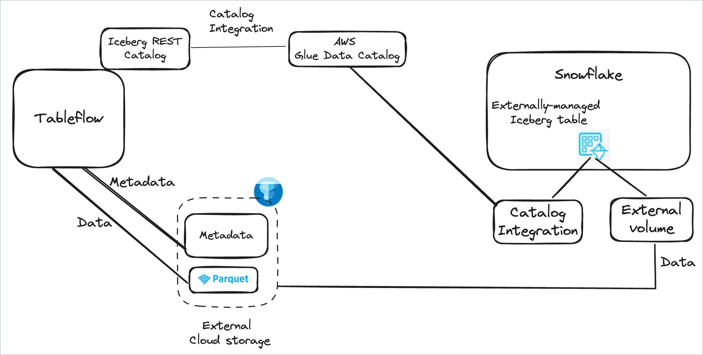

# Confluent Cloud for Apache Flink (CCAF) Tableflow AWS Glue Snowflake Kickstarter
Data practitioners are entering a golden era-a time defined by groundbreaking possibilities and transformative innovation. In the early days, building data warehouses required enormous intellectual and financial investments. We carefully engineered and maintained limited conforming dimensions and facts, continuously adapting to meet evolving business needs. Transferring data from source to target not only incurred high costs but also stripped away vital context, which had to be painstakingly rebuilt to derive actionable insights.

As we evolved to data lakes, many challenges persisted: maintenance overhead, slow adaptability to surging data demands, and the constant struggle to preserve context. With the burgeoning tide of ML and AI, the stakes have escalated even further. Yet, these challenges are paving the way for unprecedented opportunities for innovation and efficiency. Today, every obstacle is a stepping stone toward a more agile, insightful, and future-ready data landscape.

On [March 19, 2025](https://docs.confluent.io/cloud/current/release-notes/index.html#march-19-2025), Confluent proudly announced the general availability of [Tableflow for Apache Iceberg](https://docs.confluent.io/cloud/current/topics/tableflow/overview.html#cloud-tableflow), marking a transformative milestone for data lakehouses. This monumental release redefines data management by seamlessly addressing the complexities of modern data infrastructures. Leveraging the unparalleled power of Confluent's **_fully managed open-source trifecta—Apache Kafka, Apache Flink, and Apache Iceberg_**—they now deliver a unified solution that adeptly serves both operational and analytical data needs.


_Confluent Tableflow for Apache Iceberg enables you to turn a Kafka topic into an Apache Iceberg table_, usable for both operational and analytical tasks. This feature is innovative because it allows you to utilize Apache Iceberg's table format to manage your data as needed, while still leveraging Kafka's real-time streaming capabilities.


<!-- toc -->
+ [**1.0 The Impetus**](#10-the-impetus)
    - [**1.1 What is Apache Iceberg?**](#11-what-is-apache-iceberg)
        + [**1.1.1 Apache Iceberg Secret Sauce**](#111-apache-iceberg-secret-sauce)
            - [**1.1.1.1 Benefits of the Tableflow Catalog**](#1111-benefits-of-the-tableflow-catalog)
        - [**1.1.2 How Tableflow Catalog uses AWS Glue Data Catalog**](#112-how-tableflow-catalog-uses-aws-glue-data-catalog)
        - [**1.1.3 Bring Your Own Storage (BYOS)**](#113-bring-your-own-storage-byos)
    - [**1.2 Why Apache Iceberg is a Game-changer?**](#12-why-apache-iceberg-is-a-game-changer)
+ [**2.0 Now Let's Dive In!**](#20-now-lets-dive-in)
+ [**3.0 Close-up of What Was Automated for You**](#30-close-up-of-what-was-automated-for-you)
    - [**3.1 Setup Confluent Cloud Standard Kafka Cluster**](#31-setup-confluent-cloud-standard-kafka-cluster)
    - [**3.2 Setup Confluent Cloud Environment and Schema Registry Cluster**](#32-setup-confluent-cloud-environment-and-schema-registry-cluster)
    - [**3.3 Setup Confluent Cloud for Apache Flink and Execute Flink SQL Statement**](#33-setup-confluent-cloud-for-apache-flink-and-execute-flink-sql-statement)
    - [**3.4 Enable Tableflow on the `stock_trades` and `stock_trades_with_totals` Kafka topics, and Create the Amazon S3 bucket for the Apache Iceberg Metadata and Data Files**](#34-enable-tableflow-on-the-stock_trades-and-stock_trades_with_totals-kafka-topics-and-create-the-amazon-s3-bucket-for-the-apache-iceberg-metadata-and-data-files)
    - [**3.5 Store the Confluent Kafka Cluster, Schema Registry Cluster, and Service Accounts API Key Pairs in AWS Secrets Manager Secrets**](#35-store-the-confluent-kafka-cluster-schema-registry-cluster-and-service-accounts-api-key-pairs-in-aws-secrets-manager-secrets)
    - [**3.6 Setup the Snowflake User, Roles, Warehouse, Database, Schema, and Iceberg Tables**](#36-setup-the-snowflake-user-roles-warehouse-database-schema-and-iceberg-tables)
+ [**4.0 Conclusion**](#40-conclusion)
<!-- tocstop -->

## 1.0 The Impetus
The driving force behind this project is the need to **simplify** and **automate** the process of [setting up](https://docs.confluent.io/cloud/current/topics/tableflow/how-to-guides/overview.html) a Confluent Cloud environment with [Tableflow for Apache Iceberg](https://docs.confluent.io/cloud/current/topics/tableflow/overview.html#cloud-tableflow), [AWS S3 Bucket](https://docs.confluent.io/cloud/current/topics/tableflow/how-to-guides/configure-storage.html#bring-your-own-storage-byos), [AWS Glue Data Catalog](https://docs.confluent.io/cloud/current/topics/tableflow/how-to-guides/catalog-integration/integrate-with-aws-glue-catalog.html), and Snowflake Database. The goal is to eliminate the [_manual steps_](https://docs.confluent.io/cloud/current/topics/tableflow/how-to-guides/overview.html) involved in configuring these components, allowing data practitioners like you to focus on building data products instead of managing infrastructure.

Turned this picture:


Into reality:


With the assistance of [Terraform](https://developer.hashicorp.com/terraform), a powerful tool for infrastructure as code (IaC), you can define and manage your infrastructure using declarative configuration files. This project leverages Terraform to automate the setup of Confluent Cloud, AWS S3 Bucket, AWS Glue Data Catalog, and Snowflake, ensuring a **_consistent_** and **_repeatable_** deployment process.

However, this project is not just about automation; it also serves as a **_kickstarter_** for your data lakehouse journey. By providing a ready-to-use infrastructure setup, you can quickly get started with Tableflow for Apache Iceberg, enabling you to focus on building data products and utilizing the power of real-time data streaming. Before we dive into the details, let’s first understand what Apache Iceberg is and why it is a game-changer for data lakehouses.

## 1.1 What is Apache Iceberg?
The primary purpose of this project is to highlight Tableflow, Confluent Cloud's Apache Iceberg implementation.  With that said, let's answer what is Apache Iceberg.  Apache Iceberg was created in 2017 by Netflix’s Ryan Blue and Daniel Weeks. It is an open table format designed to resolve the deficiencies of working with data lakes, especially those on a distributed storage system, Amazon S3. A table format is a method of structuring a dataset’s files to present them as a unified “table.” From the user’s perspective, it can be defined as the answer to the question, “What data is in this table?” However, to implement a table format on a distributed storage system, Apache Iceberg needed to overcome several challenges posed by distributed storage systems:

Problem|Challenge|Impact|Solution
-|-|-|-
**Lack of Consistency and ACID Guarantees**|Distributed storage systems are typically designed for object storage, not traditional database operations. This leads to issues with consistency, especially during concurrent read and write operations.|Without ACID (Atomicity, Consistency, Isolation, Durability) guarantees, operations like updates, deletes, and inserts can become error-prone, leading to inconsistent data views across different sessions or processes.|_Apache Iceberg provides ACID compliance, ensuring reliable data consistency on distributed storage systems._
**Bloated Metatdata Files and Slow Query Performance**|As datasets grow in size, so does the metadata (file paths, schema, partitions) associated with them. Efficiently querying large volumes of metadata can become slow and inefficient.|Simple operations like listing files in a directory can become time-consuming, affecting the performance of queries and applications.|_Apache Iceberg organizes data into partitions and adds metadata layers, reducing the need to scan the entire dataset and optimizing query performance. This approach allows for filtering data at the metadata level, which avoids loading unnecessary files._
**Lack of Schema Evolution and Data Mutability**|Analytic datasets often require schema changes (e.g., adding or renaming columns) as business requirements evolve. Distributed storage formats typically lack built-in support for handling schema changes efficiently.|Without schema evolution support, datasets require complex data transformations or complete rewrites, which can be slow and resource-intensive.|_Apache Iceberg allows schema changes without reprocessing the entire dataset, making it easy to add new fields or alter existing ones over time._
**Inefficient Partitioning and Data Skipping**|Distributed storage systems don't natively support data partitioning, which is crucial for optimizing queries on large datasets.|Lack of partitioning increases query latency because the system has to scan more data than necessary.|_Apache Iceberg allows hidden partitioning and metadata-based pruning, ensuring queries only read the required partitions, reducing scan times and improving performance._
**Lack of Data Versioning and Time Travel**|Many analytic workflows need to access previous data versions for tasks like auditing, debugging, or historical analysis. Distributed storage doesn’t offer built-in support for versioning.|Maintaining multiple versions of the same dataset becomes cumbersome, especially without efficient version control, and can lead to excessive storage costs.|_Apache Iceberg offer time travel, allowing users to access snapshots of data at different points in time, providing easy access to historical data._
**Unable to do Concurrent Read and Write Operations**|Large analytic workloads often involve multiple processes reading from and writing to the same data simultaneously. Distributed storage systems do not inherently support these concurrent operations smoothly.|Without proper handling, this can lead to data corruption or version conflicts, especially during high-throughput operations.|_Apache Iceberg’s transactional model enables concurrent operations safely by managing snapshots and transactions, ensuring data integrity and consistency._
**Too Many Small Files**|Distributed storage systems can accumulate many small files over time due to frequent appends or updates.|Small files lead to inefficient I/O operations and high metadata costs, degrading query performance and increasing storage costs.|_Apache Iceberg handles file compaction as part of data maintenance routines, merging small files into larger ones to optimize storage and access efficiency._

By tackling these challenges head-on, Apache Iceberg enhances your data lakehouse architecture (merging the best of data lakes and warehouses) by providing:

* **Scalability** _to handle massive datasets with ease_
* **High Performance** _for fast analytical queries_
* **Simplicity** _through an intuitive and open design_
* **Cost Efficiency** _by optimizing storage and compute resources_

### 1.1.1 Apache Iceberg Secret Sauce
With the challenges resolved by Apache Iceberg when working on S3 (a distributed storage system), the question arises: how does it manage the _metadata_? This is where Apache Iceberg utilizes a **catalog engine** to:
* ACID transactions,
* time travel,
* schema evolution,
* version rollback,
* partition pruning,
* column statistics,
* data compaction,
* centralized metadata,
* simplified ETL,
* data governance, and
* integration with compute engines (e.g., **Snowflake**).

The Apache Iceberg metadata is organized in a hierarchical tree structure, with metadata files at the top, followed by manifest lists, and then manifest files:


* **Metadata files:** Files that define a table’s structure, including its schema, partitioning scheme, and a listing of snapshots.
* **Manifest lists:** Files that define a single snapshot of the table as a list of manifest files and stats on those manifests that allow for creating more efficient execution plans.
* **Manifest files:** A list of data files containing each data file’s location/path and key metadata about those data files, which allows for creating more efficient execution plans.

Tableflow includes a built-in catalog engine (a.k.a., Iceberg RESTful catalog service) called the [**Tableflow Catalog**](https://docs.confluent.io/cloud/current/topics/tableflow/how-to-guides/catalog-integration/overview.html) which provides access to the Iceberg tables created by Tableflow.  The Tableflow Catalog synchronizes with [AWS Glue Data Catalog](https://docs.aws.amazon.com/glue/latest/dg/catalog-and-crawler.html) to allow integration with compute engines like **Snowflake** and **AWS Athena**. This integration enables you to query Iceberg tables using SQL, making it easier to work with your data in a familiar way.


> **Note**: _Although it is not depicted in the drawing above, AWS Glue Data Catalog also supports integration with other compute engines like **Snowflake** (which is showcased in this project), and **Apache Spark**._

#### 1.1.1.1 Benefits of the Tableflow Catalog
The Tableflow Catalog offers several advantages beyond the typical catalog features, including:

* **Type mapping and conversions**:  Tableflow Catalog automatically transforms incoming Kafka data (such as Avro, JSON Schema, and Protobuf formats) into structured _Parquet files_, which are then materialized as Iceberg tables.

* **Schematization and Schema evolution**: Tableflow Catalog uses Confluent Schema Registry as the authoritative source for defining table schemas, ensuring structured and consistent data representation between Kafka topic records and Iceberg tables. Tableflow Catalog follows the Schema Registry’s schema compatibility modes, automatically evolving schemas while maintaining compatibility.

* **Table maintenance and optimization**: The Tableflow Catalog automatically compacts small files into larger ones when the accumulated size of the small files exceeds **_128 MB_** or **_after 15 minutes_** have passed since the last compaction. This compaction process optimizes storage and improves query performance.

### 1.1.2 How Tableflow Catalog uses AWS Glue Data Catalog
Tableflow Catalog synchronizes the Iceberg table metadata with AWS Glue Data Catalog, allowing you to use the Iceberg tables in your compute engines. This synchronization is done through a process called [**catalog integration**](https://docs.confluent.io/cloud/current/topics/tableflow/how-to-guides/catalog-integration/integrate-with-aws-glue-catalog.html#cloud-tableflow-integrate-with-aws-glue-catalog), which enables the Tableflow Catalog to register Iceberg tables in AWS Glue Data Catalog. Once registered, these tables can be queried using SQL in various compute engines that support AWS Glue Data Catalog as a metadata store, such as **Snowflake** and **AWS Athena**.

> **Note**: _The Tableflow Catalog ensures that AWS Glue Data Catalog remains current with the latest Iceberg table metadata. This means that any changes to Iceberg tables, such as schema updates or new data files, are automatically reflected in AWS Glue Data Catalog, making the Tableflow Catalog **the single source of truth** for Iceberg table metadata._

### 1.1.3 Bring Your Own Storage (BYOS)
Tableflow supports the _Bring Your Own Storage (BYOS)_ model, allowing you to use your own storage system for Iceberg tables. This lets you leverage your existing data lake infrastructure, such as **Amazon S3**, to store Iceberg tables while still enjoying Tableflow’s features and capabilities. BYOS gives you control over your data storage and enables you to use Tableflow’s powerful tools for managing and querying Iceberg tables through integration with AWS Glue Data Catalog to access Snowflake’s capabilities.

## 1.2 Why Apache Iceberg is a Game-changer?
The true power of Apache Iceberg is that it allows for the separation of storage from compute. This means we are **NO LONGER LOCKED INTO** a single data vendor’s compute engine (e.g., **Flink**, and **Snowflake**)! We store the data independently of the compute engine in our distributed storage system (Amazon S3). Then, we connect to the compute engine that best fits our use case for whatever situation we use our data in! Moreover, we could have one copy of the data and use different engines for different use cases. Now, let that sit with you!


> Imagine the freedom to choose the most cost-effective solution every time you process your data. Whether Apache Flink is more budget-friendly than Snowflake or vice versa, you have the power to decide! Your data isn’t locked into any specific compute engine, giving you ultimate flexibility to optimize for both performance and cost.


## 2.0 Now Let's Dive In!

**These are the steps**

1. Install the following on your local machine:
    - [AWS CLI version 2](https://docs.aws.amazon.com/cli/latest/userguide/getting-started-install.html)
    - [Confluent CLI version 4 or higher](https://docs.confluent.io/confluent-cli/4.0/overview.html)
    - [Terraform CLI version 1.12.2 or higher](https://developer.hashicorp.com/terraform/install)

2. Get your Confluent Cloud API key pair by executing the following Confluent CLI command to generate the Cloud API Key (click [here](.blog/why-do-you-need-the-confluent-cloud-api-key.md#2-integration-with-cicd-pipelines) to learn why you need it):

    ```shell
    confluent api-key create --resource "cloud" 
    ```

    The API Key pair allows Terraform to provision, manage, and update Confluent Cloud resources as defined in your infrastructure code, maintaining a secure, automated deployment pipeline.

3. Clone the repo:
    ```bash
    git clone https://github.com/j3-signalroom/ccaf-tableflow-aws_glue-snowflake-kickstarter.git
    ```

    > You will then supply the created Cloud API Key and Cloud API Secret to the `./deploy.sh` script in step 6c.

4. Apart of the Terraform configurations, is the `snowflake_user_rsa_key_pairs_rotation`, the [`iac-snowflake-service_user-rsa_key_pairs_rotation-tf_module`](https://github.com/j3-signalroom/iac-snowflake-service_user-rsa_key_pairs_rotation-tf_module) Terraform [module](https://developer.hashicorp.com/terraform/language/modules) to automate the creation and rotation of [RSA key pairs](https://github.com/j3-signalroom/j3-techstack-lexicon/blob/main/cryptographic-glossary.md#rsa-key-pair) for a Snowflake service account user.  It leverages a specialized AWS Lambda function, known as the [`iac-snowflake-service_user-rsa_key_pairs_and_jwt_generator-lambda`](https://github.com/j3-signalroom/iac-snowflake-service_user-rsa_key_pairs_and_jwt_generator-lambda), to automate the generation and rotation of RSA key pairs. The module allows users to define rotation intervals (e.g., every 30 days since the last key generation) to enhance security by regularly renewing cryptographic credentials. Additionally, it integrates seamlessly with AWS Secrets Manager to securely store and manage the generated key pairs, ensuring that the keys remain protected and easily accessible for Snowflake authentication without manual intervention.

5. Update the cloned Terraform module's [main.tf](main.tf) by following these steps:

    a. Locate the `terraform.cloud` block and replace **`signalroom`** with your [Terraform Cloud Organization Name](https://developer.hashicorp.com/terraform/cloud-docs/users-teams-organizations/organizations).

    b. In the `terraform.cloud.workspaces` block, replace **`ccaf-tableflow-aws-glue-snowflake-kickstarter`** with your [Terraform Cloud Organization's Workspaces Name](https://developer.hashicorp.com/terraform/cloud-docs/workspaces).

6. To run repo's [Terraform configuration](main.tf) locally, follow these steps:

    a. Navigate to the root folder of the `ccaf-tableflow-aws_glue-snowflake-kickstarter/` repository that you cloned.

    b. Open a terminal in that directory.

    c. Execute the following [script](./deploy.sh) bash script to deploy the project’s Terraform configuration locally. This command sets up a Confluent Cloud environment with a Kafka Cluster configured for Tableflow, AWS Secrets Manager, an AWS S3 bucket, AWS Glue Data Catalog, and a Snowflake Database:

    > **Note**: _The script and this project, in general, assume your hyperscaler is **AWS**. Additionally, it is expected that the AWS account is configured with SSO (Single Sign-On) support._

    ```bash
    ./deploy.sh <create | delete> --profile=<SSO_PROFILE_NAME> \
                                  --confluent-api-key=<CONFLUENT_API_KEY> \
                                  --confluent-api-secret=<CONFLUENT_API_SECRET> \
                                  --snowflake-warehouse=<SNOWFLAKE_WAREHOUSE> \
                                  --admin-service-user-secrets-root-path=<ADMIN_SERVICE_USER_SECRETS_ROOT_PATH> \
                                  [--day-count=<DAY_COUNT>] \
                                  [--debug]
    ```
    > Argument placeholder|Replace with
    > -|-
    > `<SSO_PROFILE_NAME>`|Your AWS SSO profile name for your AWS infrastructue that host your AWS Secrets Manager.
    > `<CONFLUENT_API_KEY>`|Your organization's Confluent Cloud API Key (also referred as Cloud API ID).
    > `<CONFLUENT_API_SECRET>`|Your organization's Confluent Cloud API Secret.
    > `<SNOWFLAKE_WAREHOUSE>`|The Snowflake warehouse (or "virtual warehouse") you choose to run the resources in Snowflake.
    > `<ADMIN_SERVICE_USER_SECRETS_ROOT_PATH>`|The root path in AWS Secrets Manager where the admin user secrets are stored.
    > `[<DAY_COUNT>]`|(_Default:_ `30`, when not included) How many day(s) should the API Key be rotated for.

    > Flags:
    > - `[--debug]`: (_Default:_ `false`, when not included) Enable debug mode for more verbose output during the `terraform apply` process.

    To learn more about this script, click [here](.blog/deploy-script-explanation.md).

## 3.0 Close-up of What Was Automated for You
The following sections provide a detailed overview of the resources and configurations that were automatically set up for you by the Terraform script. This includes the:
* Confluent Cloud environment, 
* Creating the Flink Statement, 
* Enabling Tableflow, 
* AWS S3 bucket, 
* AWS Glue Data Catalog, and 
* Snowflake Database.

Below is the Terraform visualization of the configuration. It displays the resources and their dependencies to help make the infrastructure easier to understand.


> **To fully view the image, open it in another tab on your browser to zoom in.**

**The magic behind the Terraform Graph**

As you can see, the Terraform graph is a powerful tool that visualizes dependencies between resources in your infrastructure. It helps you understand how different components interact and the order in which they are created or destroyed. For example, the graph shows how Confluent Cloud resources depend on AWS services and Snowflake objects, ensuring everything is provisioned correctly. Additionally, the graph makes it easy to identify potential bottlenecks or issues that may occur during provisioning.

To use this useful tool in your project, you just need the [Graphviz](https://graphviz.gitlab.io/download/) tool installed on your machine to generate the graph. For instance, in this project, the following command is run:

```bash
terraform graph | dot -Tpng > .blog/images/terraform-visualization.png
```

This will create a PNG image of the graph, which you can view to gain insights into your infrastructure.

### 3.1 Setup Confluent Cloud Standard Kafka Cluster
The [`setup-confluent-kafka.tf`](setup-confluent-kafka.tf) is responsible for deploying a Confluent Cloud Standard Kafka Cluster with Consumer and Producer service accounts that have the appropriate RBAC (Role-Based Access Control) privileges, along with a DataGen Source Connector to generate sample stock trade records in a Kafka topic called `stock_trades` that will be used to demonstrate Tableflow.

Otherwise, if you didn’t use the automated Terraform script, you’ll have to do the following manually by following the instructions on these web pages:
* [Manage Kafka Clusters on Confluent Cloud](https://docs.confluent.io/cloud/current/clusters/create-cluster.html)
* [Datagen Source Connector for Confluent Cloud](https://docs.confluent.io/cloud/current/connectors/cc-datagen-source.html)

### 3.2 Setup Confluent Cloud Environment and Schema Registry Cluster
The [`setup-confluent-environment.tf`](setup-confluent-environment.tf) and [`setup-confluent-schema_registry.tf`](setup-confluent-schema_registry.tf) are responsible for deploying a Confluent Cloud Environment and its Schema Registry Cluster with a service account that has the appropriate RBAC (Role-Based Access Control) privileges.

Otherwise, if you didn’t use the automated Terraform script, you’ll have to do the following manually by following the instructions on these web page(s):
* [Quick Start for Schema Management on Confluent Cloud](https://docs.confluent.io/cloud/current/get-started/schema-registry.html)

### 3.3 Setup Confluent Cloud for Apache Flink and Execute Flink SQL Statement
The [`setup-confluent-flink.tf`](setup-confluent-flink.tf) is responsible for deploying a Confluent Cloud for the Apache Flink Compute Pool and executing a Flink SQL statement to create a sink Kafka topic called `stock_trades_with_totals`, which summarizes the trades (price * quantity) by trade timestamp, user ID, side, and stock symbol.

Otherwise, if you didn’t use the automated Terraform script, you’ll have to do the following manually by following the instructions on these web page(s):
* [Stream Processing with Confluent Cloud for Apache Flink](https://docs.confluent.io/cloud/current/flink/overview.html#stream-processing-with-af-long)

### 3.4 Enable Tableflow on the `stock_trades` and `stock_trades_with_totals` Kafka topics, and Create the Amazon S3 bucket for the Apache Iceberg Metadata and Data Files
The [`setup-confluent-tableflow.tf`](setup-confluent-tableflow.tf) is responsible for configuring Tableflow integration support for AWS Glue Data Catalog, enabling AWS Glue Data Catalog and Amazon S3 permissions to each other and the Confluent Cloud Kafka Cluster via the [`setup-confluent-tableflow-aws-s3-glue.tf`](setup-confluent-tableflow-aws-s3-glue.tf) configuration, and enabling Tableflow on the `stock_trades` and `stock_trades_with_totals` Kafka topics.  Along with the [`setup-aws-s3.tf`](setup-aws-s3.tf) that is responsible for creating the Amazon S3 bucket for Tableflow.

Otherwise, if you didn’t use the automated Terraform script, you’ll have to do the following manually by following the instructions on these web pages:

* [Configure AWS Glue Catalog integration](https://docs.confluent.io/cloud/current/topics/tableflow/how-to-guides/catalog-integration/integrate-with-aws-glue-catalog.html#cloud-tableflow-integrate-with-aws-glue-catalog)

* [Bring Your Own Storage (BYOS)](https://docs.confluent.io/cloud/current/topics/tableflow/how-to-guides/configure-storage.html#cloud-tableflow-storage-byos)

### 3.5 Store the Confluent Kafka Cluster, Schema Registry Cluster, and Service Accounts API Key Pairs in AWS Secrets Manager Secrets
The [`setup-aws-secret_manager.tf`](setup-aws-secret_manager.tf) is responsible for storing all the Confluent Kafka Cluster, Schema Registry Cluster, and Service Accounts API Key Pairs in AWS Secrets Manager Secrets.

> _Storing the API Key Pairs in AWS Secrets Manager offers the advantage of securely managing and accessing sensitive information, like API keys, without embedding them directly in your application code or configuration files. This improves security by lowering the chance of accidentally exposing sensitive credentials._

### 3.6 Setup the Snowflake User, Roles, Warehouse, Database, Schema, and Iceberg Tables
The [`setup-snowflake-user.tf`](setup-snowflake-user.tf) file is responsible for configuring the Snowflake user and roles to access the Snowflake environment via the [`snowflake_user_rsa_key_pairs_rotation`](https://github.com/j3-signalroom/iac-snowflake-service_user-rsa_key_pairs_rotation-tf_module) module, and enabling Snowflake to access the Amazon S3 bucket. Additionally, the [`setup-snowflake-objects.tf`](setup-snowflake-objects.tf) file handles creating the Snowflake Database, Schema, External Volume, Catalog Integration, and Iceberg Tables, along with the [`setup-snowflake-aws-s3-glue.tf`](setup-snowflake-aws-s3-glue.tf) to set up the AWS IAM permissions and trusted policies required to query the Apache Iceberg tables using SnowSQL!


Otherwise, if you didn’t use the automated Terraform script, you’ll have to complete steps 1 through 7 manually by following the instructions [here](https://docs.confluent.io/cloud/current/topics/tableflow/how-to-guides/query-engines/query-with-snowflake.html#use-snowflake-with-aws-glue-data-catalog-integration).

## 4.0 Conclusion
Using Terraform, you can **_reliably_** and **_consistently_** deploy automatically with just a few keystrokes. Leverage the fully managed open-source trio—**_Apache Kafka, Apache Flink, and Apache Iceberg_**—along with **Snowflake** to enhance your data lakehouse architecture.  For instance, you have:

* A **Confluent Cloud environment** featuring a Standard Kafka Cluster, fully equipped with a pre-configured example Kafka topic called `stock_trades`.
* Configure the **Datagen Source Connector** to provide continuous synthetic stock trades data to the example Kafka topic.
* **AWS Secrets Manager** securely stores the project’s secrets.
* Example of using **Confluent Cloud for Apache Flink** to aggregate stock trades in a Kafka topic, `stock_trades_with_totals`, continuously.
* Enable Tableflow on the `stock_trades` and `stock_trades_with_totals` Kafka topics, which automatically creates an Apache Iceberg table in the background.
* An **AWS S3 bucket** used for storing the metadata and data files of Apache Iceberg tables.
* Integrate the Tableflow Catalog with **AWS Glue Data Catalog** to connect with **Snowflake**.
* Use **Snowflake** to query the Kafka Topic Tableflow-enabled Apache Iceberg Tables with **SnowSQL**.

**_Welcome to the forefront of the data revolution, where every challenge is an opportunity and innovation knows no bounds!_**
